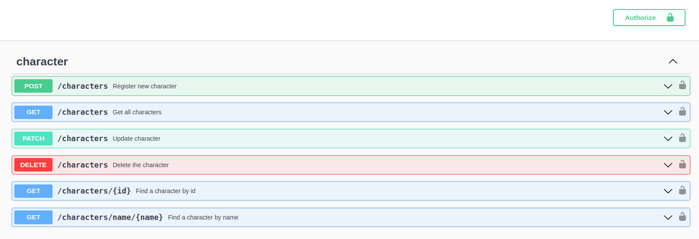

# Red-Boar-Inn Game API

- [Red-Boar-Inn Game API](#red-boar-inn-game-api)
  - [Structure](#structure)
  - [Documentation](#documentation)
  - [Endpoints](#endpoints)

## Structure

[STRUCTURE](STRUCTURE.md)

## Documentation

[SCRIPT - swagger](swagger/build/)

## Endpoints

