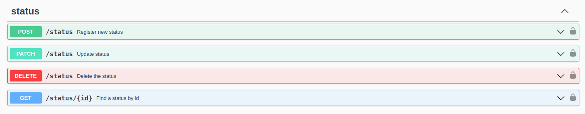

# Red-Boar-Inn Server API

- [Red-Boar-Inn Server API](#red-boar-inn-server-api)
  - [Start](#start)
  - [Structure](#structure)
  - [Documentation](#documentation)
  - [Scripts](#scripts)
  - [Endpoints](#endpoints)
    - [Character](#character)
    - [Status](#status)
    - [Inventory](#inventory)
    - [Equipment](#equipment)
    - [Skills](#skills)

## Start

[run - project](START.md)

## Structure

[tree - structure](STRUCTURE.md)

## Documentation

[doc - swagger](../swagger.json)

## Scripts

[scripts > tree - doc](../scripts/)

## Endpoints

### Character

### Status

### Inventory

### Equipment

### Skills

